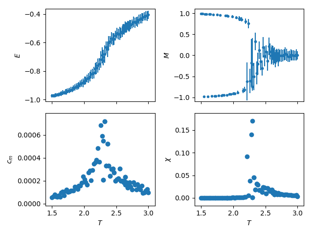

# Ising-Model
A simple implementation of the 2d Ising Model using the MonteCarlo method.

Below I present an example of the data obtained using this code for a lattice of 30x30 spins, each point is obtained simulating the system for temperatures around the critical with 10000 iterations.

# License
   Copyright   2019    labay11

   Licensed under the Apache License, Version 2.0 (the "License");
   you may not use this file except in compliance with the License.
   You may obtain a copy of the License at

       http://www.apache.org/licenses/LICENSE-2.0

   Unless required by applicable law or agreed to in writing, software
   distributed under the License is distributed on an "AS IS" BASIS,
   WITHOUT WARRANTIES OR CONDITIONS OF ANY KIND, either express or implied.
   See the License for the specific language governing permissions and
   limitations under the License.
